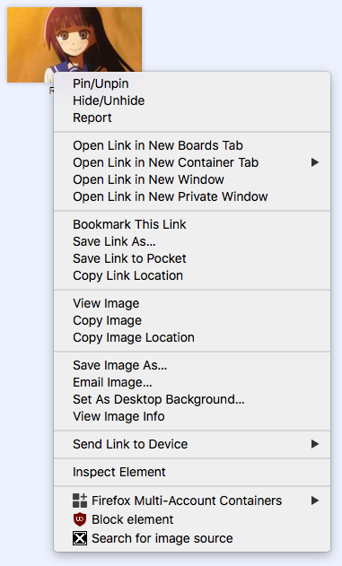

# reverseimage

Browser extension to add reverse image search button inside the context menu, current release is for Firefox only.
Services used for reverse image search are: Google, Yandex and SauceNAO.
